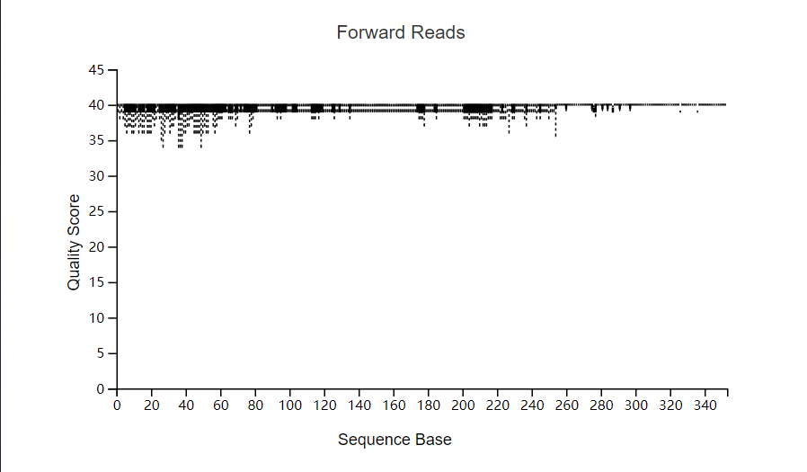

# 16s rDNA分析

参考教程[QIIME 2教程. 07Cell帕金森小鼠Parkinson‘s Mouse(2020.11，最佳实战)](https://metagenome.blog.csdn.net/article/details/76647849)

从ebi上下载的16s rDNA序列，其格式为fastq，即带有质量信息的序列数据。数据中没有引物序列。

### 从ncbi和ebi下载数据.

参考[GMrepo2021 数据下载](https://shimo.im/docs/UR6aCGC4ZNUm2Tuj/read)

accession list：'filereport_read_run\_*_tsv.txt' (因项目而异)

- 提取run ID，保存为'runs.uniq.lst':

```shell
more filereport_read_run_* | cut -f 4 | sort | uniq | awk '!/run_accession/{print}' > runs.uniq.lst
```

- 运行脚本，下载序列文件：

```shell
sh /mnt/raid8/datarepo/scripts/01_download_rawdata.sh runs.uniq.lst   ena   fastq 
```

注1：在 screen session中运行此命令，以避免网络中断造成命令停止

### 导入数据成为qiime2 对象

使用qiime2进行分析。第一步是写一个manifest文件，manifest文件包含样本id和数据绝对路径的信息。

从ncbi上可以下载到项目的metadata,利用其中的信息可以比较容易的完成manifest

```python

    
```

导入数据可视化, 看质量信息



### 去噪

使用data2去噪，获得data2_stats.qza, 可视化的结果是data2_stats.qzv, 打开可视化结果,将其导出成为metadata, 供后面的步骤使用。

去噪时， 根据之前得到的质量信息， 选择合适的修剪长度

### 物种注释


